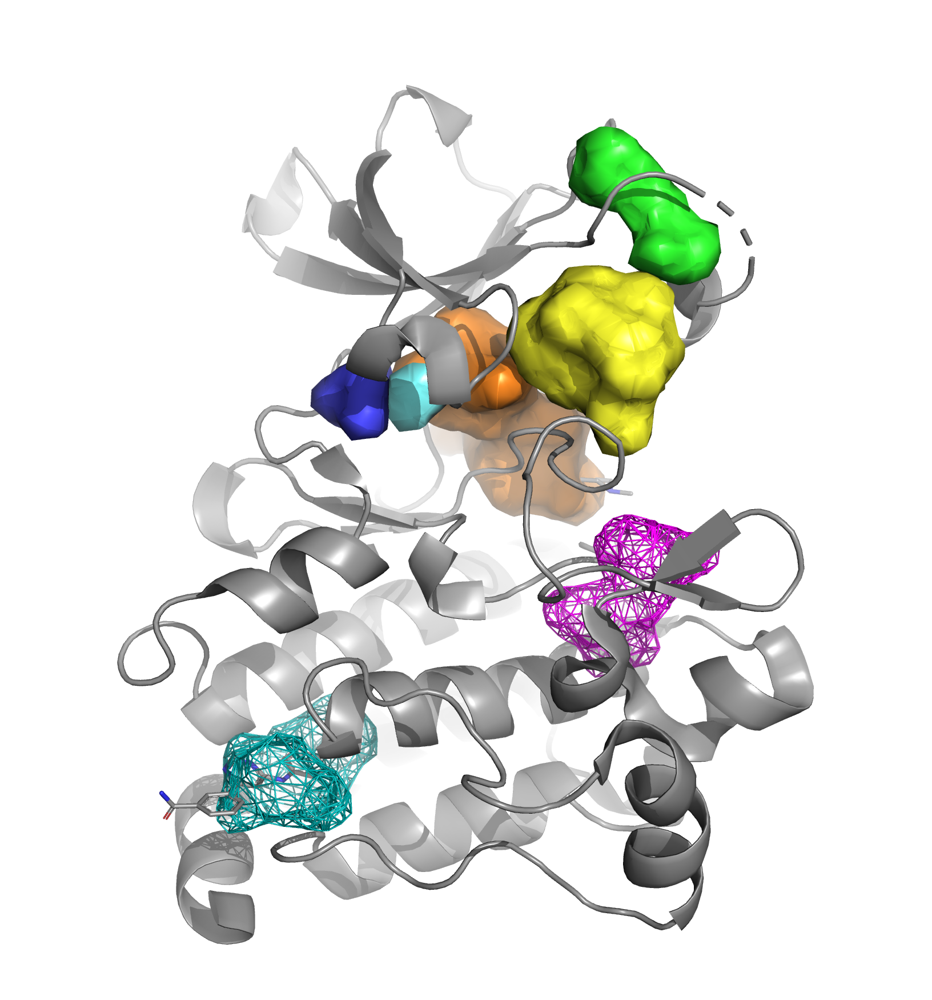

***********************************************************************
PyVOL: Protein Pocket Visualization, Segmentation, and Characterization
***********************************************************************

.. image:: https://img.shields.io/pypi/v/bio_pyvol.svg

.. image:: https://img.shields.io/pypi/l/bio_pyvol.svg

.. marker-start-introduction

  PyVOL Pocket Identification

Overview
--------

PyVOL is a python library packaged into a `PyMOL <https://pymol.org/2/>`_ GUI for identifying protein binding pockets, partitioning them into sub-pockets, and calculating their volumes. PyVOL can be run as a PyMOL plugin through its GUI or the PyMOL prompt, as an imported python library, or as a command-line program. Visualization of results is exclusively supported through PyMOL though exported surfaces are compatible with standard 3D geometry visualization programs. The project is hosted on github by the Schlessinger Lab. Please access the repository to view code or submit bugs. The package has been most extensively tested with PyMOL 2.3+ running Python 3.7. Support for all python versions 2.7+ is intended but not as thoroughly tested. Support for PyMOL 1.7.4+ without the GUI is as yet incomplete. Unfortunately, PyVOL can not currently run on MacOS Catalina due to its restrictions on running 32-bit executables. The Mac-compatible MSMS executable is not yet available in a 64-bit form.
