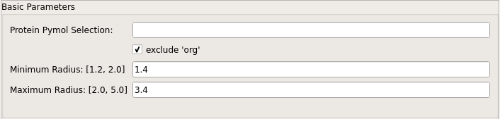

===========
Basic Usage
===========

PyVOL accepts inputs from the PyMOL prompt, the PyMOL GUI, and configuration files via the system shell. The PyMOL prompt and configuration file inputs are fully featured while the GUI contains a slightly simplified interface with a few enforced defaults. Programmatic invocation is also supported and covered through module documentation.

The next few sections describe the parameters controlling Basic Usage, :ref:`pocket_specification:Pocket Specification`, :ref:`partitioning:Partitioning Options`, and :ref:`display:Output and Display Options`. With the exception of PyMOL-specific arguments, parameter names and argument handling are identical across all inputs.

  The Basic Parameters section of the PyVOL GUI

Protein Selection
-----------------

The `Protein` selection for processing can be provided using one of two arguments. The `prot_file` argument directs PyVOL to read a structure from file. All included atoms are considered to be part of the pocket boundary (all atoms that occlude space). Alternatively, input through either PyMOL interface allows specification of the `protein` argument. This is a PyMOL selection string that defines the pocket boundary.

When providing input through PyMOL, the Boolean `protein_only` argument (checkbox in the GUI) can be set to restrict the `protein` selection to peptide atoms. This is enabled in the GUI by default and excludes all waters, solvent molecules, and other small-molecules from the pocket boundary. This is normally useful, but if a co-factor should be considered part of the binding site and excluded from the available volume, it can make sense to group it with the peptide for the purpose of calculating the solvent excluded surface.

.. code-block:: python

  # arguments: protein, prot_file
  pocket prot_file=<protein_pdb_filename>
  pocket protein=<"PyMOL selection string">, protein_only=True

Minimum and Maximum Probe Radii
-------------------------------

The most important parameters controlling PyVOL pocket identification and boundary location are the minimum and maximum radii (`min_rad` and `max_rad` arguments) used for surface identification. The maximum radius determines the size of the probe used to identify regions accessible to bulk solvent. This parameter should be chosen to exclude any binding pockets of interest while not overly distorting the surface of the protein. Generally, values around 3.4 Å are reasonable, but this parameter can be set lower to increase pocket detection stringency or set higher to reduce stringency. The drawback to setting `max_rad` too high is that this can lead to the identification of unreasonable, shallow pockets that snake around the surface of the protein. The minimum radius controls two factors: the level of detail of the calculated binding pocket surfaces and the algorithmic lower limit to minimum internal radii of identified binding pockets. Lower minimum radii calculate the accessibility to smaller solvent molecules. This necessarily increases the number of nooks or crannies in the binding pocket surface that are calculated and can link adjacent pockets that can not accommodate even small organic molecules. If the purpose of volume calculations is to identify protein features relevant to compound binding, such behavior is undesirable. From such a perspective, setting the minimum radius to approximately that of the smallest pharmacophore radius of potential ligands makes sense for calculations. However, the radius of water is the default setting because it meets the typical expectation of users looking at solvent excluded surfaces.

.. code-block:: python

  # arguments min_rad, max_rad
  pocket prot_file=<protein_pdb_filename>, min_rad=<1.4>, max_rad=<3.4>
  pocket protein=<"PyMOL selection string">, min_rad=<1.4>, max_rad=<3.4>

Input Constraint
----------------

By default, basic input radii parameters are compared and constrained to tested ranges using the `constrain_radii` argument. This can be turned off when running outside of the GUI, but in practice it is never useful to disable this feature. While edge cases are possible in which violating constraints is useful, in practice these constraints represent effective ranges. In particular, if the minimum radius is set to absurdly low values, the software will start fitting pockets even within intramolecular spaces and provide meaningless output if not fully crashing the program.

.. code-block:: python

  # arguments constrain_radii
  pocket prot_file=<protein_pdb_filename>, min_rad=<1.4>, max_rad=<3.4>, constrain_radii=True
  pocket protein=<"PyMOL selection string">, min_rad=<1.4>, max_rad=<3.4>, constrain_radii=True

.. note::

  Be careful about saving `.pse` PyMOL sessions with PyVOL-produced surfaces. PyMOL does not currently use plugins to load unfamiliar CGO objects, so calculated surfaces will not load correctly from a saved PyMOL session. On the other hand, it should be possible to recreate results using saved PyMOL `.pml` logs. Surfaces can be loaded back into a session using the `Load Pocket` (command-line `load_pocket`) commands.
