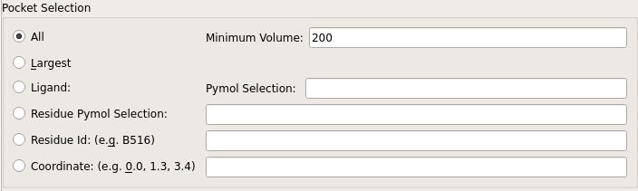

====================
Pocket Specification
====================

PyVOL runs in one of three modes (`largest`, `specific` or `all`). By default it runs in `largest` mode and returns only the single volume and geometry corresponding to the largest pocket identified when calculating `all` pockets. However, manual identification of the pocket of interest is often preferable. This can be done through specification of a ligand, a residue, or a coordinate. If any specification is given, the mode automatically changes to `specific`. The `specific` mode is the fastest by a small margin because it calculates the fewest surfaces.

  GUI section controlling user specification of binding pockets

Largest Mode
------------

In the default `largest` mode, PyVOL determines all surfaces with inward-facing normals, calculates the volume of each, and selects the largest. The pocket selected with this mode is usually the pocket of pharmacological interest in a protein. However, sometimes changes in the minimum or maximum radius can lead to the unexpected selection of an alternative, normally superficial pocket.

.. code-block:: python

  # arguments: mode
  pocket prot_file=<protein_pdb_filename>, mode=largest
  pocket protein=<"PyMOL selection string">, mode=largest

All Mode
--------

When running in `all` mode, PyVOL determines all surfaces with inward-facing normals with volumes over a minimum threshold defined by the `Minimum Volume` (`min_volume` argument). This functions similarly to the `largest` mode except that 1) all surfaces are returned rather than just the largest, 2) if the largest surface has a volume less than `Minimum Volume`, no surface will be returned at all, and 3) subpocket partitioning cannot occur on the output from this mode. By default the minimum volume is set to 200 ų. This is a heuristically determined threshold that is generally useful at distinguishing between artifacts and interesting pockets.

.. code-block:: python

  # arguments: mode, min_volume
  pocket prot_file=<protein_pdb_filename>, mode=all, min_volume=<200>
  pocket protein=<"PyMOL selection string">, mode=all, min_volume=<200>

Specific Mode
-------------

The final mode, the `specific` mode, is invoked through specification of a ligand, residue, or coordinate. PyVOL automatically switches to this mode if any specification is provided, but this behavior can be overriden. Manual specification of the `specific` mode is safer. There is an internal priority to which specification is used, but only a single option should be specified to avoid ambiguity.

Ligand Specification
^^^^^^^^^^^^^^^^^^^^

A ligand occupying the binding pocket of interest can be specified similarly to protein definition. All inputs can accept a `lig_file` argument specifying a pdb file containing ligand geometry, and PyMOL inputs can accept a `ligand` argument containing a PyMOL selection string. If the `ligand` argument is provided, atoms belonging to the `ligand` are removed from the `protein` selection before pocket identification. In all cases, bulk solvent boundary determination includes the provided ligand, so ligands that extend somewhat beyond the convex hull of the protein can include some of that volume within the calculated binding pocket. In these cases the calculated volumes depend on the exact identity and pose of the ligand provided. This option is improper for *apo* volumes with the trade-off that calculated volumes can be meaningfully compared to small molecule volumes.

.. code-block:: python

  # arguments: lig_file, ligand
  pocket prot_file=<protein_pdb_filename>, mode=specific, ligand=<ligand_pdb_filename>
  pocket protein=<"PyMOL selection string">, mode=specific, lig_file=<"ligand selection string">

  # Trivial case in which a single organic small molecule is present in the protein selection
  pocket protein=<"PyMOL selection string">, ligand=<"'PyMOL selection string' and org">

Supplying a ligand opens up two additional options. `Inclusion Radius` (`lig_incl_rad` argument) prevents the exterior surface of the protein (bulk solvent surface definition) from being defined within that distance from the ligand. In cases where a ligand extends somewhat into solvent and calculated volumes would otherwise be smaller than the volume of the known ligand, this can be used to produce a more useful surface. `Exclusion Radius` (`lig_excl_rad` argument) limits the maximum scope of the identified surface as the locus of points that distance from the supplied ligand. Both of these options introduce a heuristic that alters reported results. They are most useful when standardizing volumes across a series of similar structures as they provide a mechanism to limit volume variability due to variation in bulk solvent boundary determination.

.. code-block:: python

  # arguments: lig_incl_rad, lig_excl_rad
  pocket prot_file=<protein_pdb_filename>, mode=specific, ligand=<ligand_pdb_filename>, lig_incl_rad=<3.5>, lig_excl_rad=<5.2>
  pocket protein=<"PyMOL selection string">, mode=specific, lig_file=<"ligand selection string">, lig_incl_rad=<3.5>, lig_excl_rad=<5.2>

.. note::

  SDF format ligand files are not currently supported for input using `lig_file` because that would increase the number of software dependencies. Reading the sdf file into PyMOL and then passing the ligand into PyVOL using the `ligand` argument is the current solution.

Residue Specification
^^^^^^^^^^^^^^^^^^^^^

A bordering residue can be supplied to localize a pocket. Once again, this can be done either by specifying a residue ID or with a PyMOL selection string when running through PyMOL. The `resid` argument accepts a string specifying a residue by chain and index (i.e., residue 25 of chain A would be "A35"). The chain is inferred if not explicitly included. Only sidechain atoms are considered. The PyMOL `residue` argument allows specification of a PyMOL selection bordering the pocket of interest. This selection can be of arbitrary size but has been primarily tested holding single residues. Only the sidechains of the provided selection are used for pocket specification. In both of these cases, PyVOL tries to identify the residue atom closest to an interior surface and uses that atom to specify the adjacent pocket of interest. Some residues are adjacent to multiple pockets and make specification computationally arbitrary and unpredictable. If having trouble, specify a single atom as a PyMOL selection string.

.. code-block:: python

  # arguments: resid, residue
  pocket prot_file=<protein_pdb_filename>, mode=specific, resid=<chain/residue_index>
  pocket protein=<"PyMOL selection string">, mode=specific, residue=<"residue selection string">

Coordinate Specification
^^^^^^^^^^^^^^^^^^^^^^^^

The final method for specifying a pocket of interest is through providing a coordinate that is within the pocket using the `coordinates` argument. PyVOL identifies the closest atom in the protein selection to the supplied coordinate and uses it to define the surface of the calculated pocket. The coordinate value is accepted as a string of three floats with commas in between values (e.g., "23.1, 47.2, -12.7").

.. code-block:: python

  # arguments: coordinates
  pocket prot_file=<protein_pdb_filename>, mode=specific, coordinates="x,y,z"
  pocket protein=<"PyMOL selection string">, mode=specific, coordinates="x,y,z"
